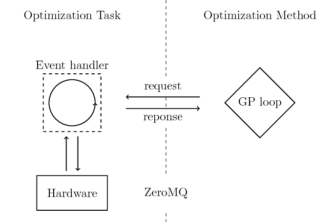

Glyph remote
============

glyph-remote is shipped together with the glyph package. After
installation, the ``glyph-remote`` command is available at the command
line.

Concept
-------

With glyph-remote the separation between optimization method and
optimization task is made easy. glyph-remote runs multi IO symbolic
regression and sends candidate solution via ZeroMQ to an experiment
controller for assessment. Every hyper-parameter used is assessable and
fully configurable.

Overview
--------

To the right the optimization method is represented. The GP program can
be seen as a black box which is only accessible by the specified
interface. To the left a single experiment plus an event handler is
depicted. The latter glues optimization method and task together and
needs to understand the communication protocol defined in

Currently we use `client server sockets <http://learning-0mq-with-pyzmq.readthedocs.io/en/latest/pyzmq/patterns/client_server.html>`_ for glyph remote. **The user needs to implement the zmq.REP socket.**

Communication protocol
----------------------

The communication is encoded in json. A message is a json object with
two members:

.. code:: json

    {
        "action": "value",
        "payload": "value",
    }

The possible action values are:

+-------------------+--------------------+----------------------------+
| Action name       | Payload            | Expected return Value      |
+===================+====================+============================+
| *CONFIG*          | –                  | config settings            |
+-------------------+--------------------+----------------------------+
| *EXPERIMENT*      | list of expressions| list of fitness value(s)   |
+-------------------+--------------------+----------------------------+
| *METADATA*        | –                  | any                        |
+-------------------+--------------------+----------------------------+
| *SHUTDOWN*        | –                  | –                          |
+-------------------+--------------------+----------------------------+

The config action is performed prior to the evolutionary loop. Entering
the loop, for every discovered solution an *experiment* action will be
requested. Since most experiments have an intermediate compiling step, expressions will come in chunks. You can configure optional caching for re-discovered solutions.
The *shutdown* action will let the experiment program know
that the gp loop is finished and you can safely stop the hardware.

Config
~~~~~~

See Configuration section.

Experiment
~~~~~~~~~~

The *experiment* request expects a fitness value for each expression:

.. code:: json

    {
        "fitness": ["value0", "value1", ...],
    }

Shutdown
~~~~~~~~

You can properly shut down the experiment hardware.

Configuration
-------------

For a full list of configuration options and their default values type
``glyph-remote --help``.

All hyper-parameters and algorithms used have default values. You have
three options to set parameters:

* use the command line interface
* read from file (using ``--cfile myfile.yaml``)
* request from event handler (using ``--remote``)

At cli, options are specified using ``--key value``. The configuration
file has to be written in yaml, i.e.

.. code:: yaml

    key: value

The event handler should send back a similar json array

.. code:: json

    {
      "key": "value",
    }

It is mandatory to provide a information about the primitives you want
to use. The value of the "primitives" key is again a json/yaml list
specifying name: arity pairs. Arities greater one are functions, equal
to one are variables and -1 is reserved for symbolic constants.

.. code:: json

    {
      "primitives":
      {
        "add": 2,
        "x": 0,
      },
    }

GUI
---

Install
~~~~~~~

Glyph comes with an optional GUI to use the ``glyph-remote`` script with more convenience.

The GUI uses the package ``wxPython``. The installation manual can be found `here <https://github.com/wxWidgets/Phoenix/blob/master/README.rst#prerequisites>`_
and `Website <https://wxpython.org/>`_.

**Manual Gooey installtion**

Since up-to-date (28.08.2018) the necessary changes to the used graphic library Gooey are not part of the master branch,
it might be necessary to install Gooey by hand from this fork:

- ``pip install -e "git+git@github.com:Magnati/Gooey.git#egg=gooey"``

**Installation with pip installtion**

To install glyph including the gui option use the following command:

.. code-block::

    python pip install pyglyph[gui]``

To start the script with the gui just use the ``--gui`` parameter:

.. code-block::

    glyph-remote --gui

Usage
~~~~~~

Within the GUI there is a tab for each group of parameters.
If all parameters are set, click the start-button to start the experiment.

Pretesting & Constraints
------------------------

In glyph-remote, genetic operations can be constrained. A genetic operation (i.e. every operation that create or modifies the genotype of an individual).
If a constraint is violated, the genetic operation is rejected. If out of time, the last candidate is used.

Currently, two different types of constraints are implemented:
- algebraic constraints using sympy
- pretesting constraints

Algebraic constraints
~~~~~~~~~~~~~~~~~~~~~

Sympy is used to check whether expressions are:

- zero
- constant
- infinite

The three options can be individually activated.

Pretesting
~~~~~~~~~~

You can invoke file-based pretesting with the `--constraints_pretest filename.py` flag.
The flag `--constraints_pretest_function` lets you pass the function name which will be invoked to pretest individuals.

The function is expected to return a boolean, depending on the individual is rejected (False) or accepted (True).

An example file could look like this:

.. code:: python

    import time

    def chi(ind):
        time.sleep(1)
        print(f"Hello World, this is {ind}")
        return True

